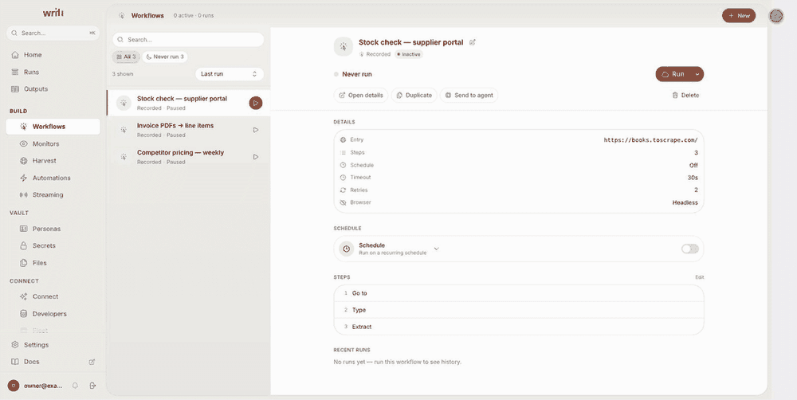
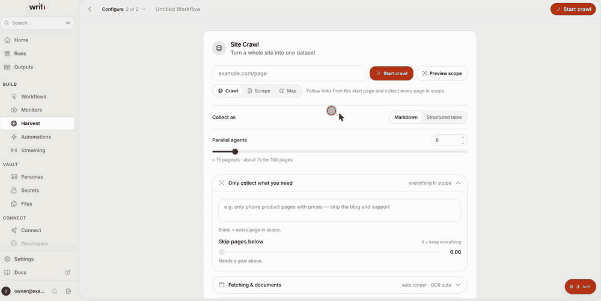
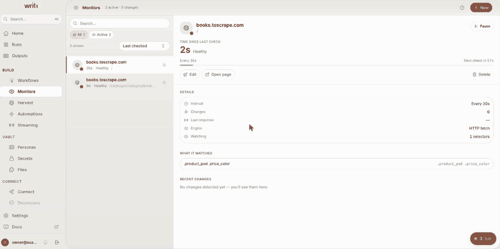
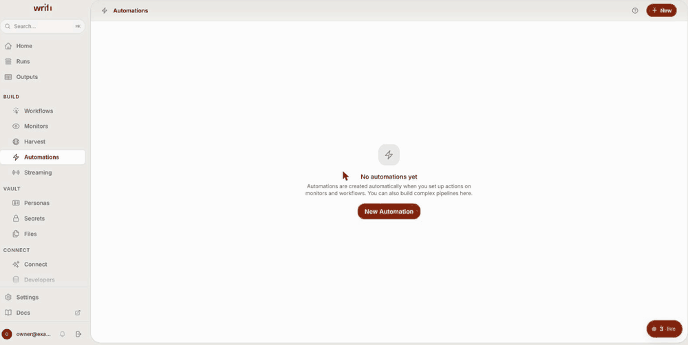
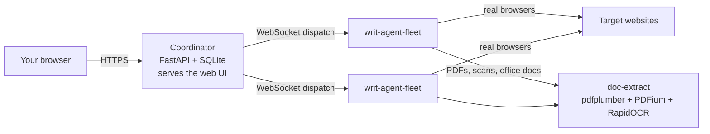

<div align="center">
  

  <br/>

  <p align="center">
    <a href="https://github.com/usewrit/writ/actions/workflows/ci.yml"></a>
    <a href="./LICENSE"></a>
    
    
    
    
    
  </p>

  <h3 align="center">Record a web task once. Replay it forever — free every run, on hardware you own.</h3>
  <p align="center">Turn any website into a workflow, a REST API, or an MCP tool.</p>

  <p align="center">
    <a href="#quickstart"><b>Quickstart</b></a> ·
    <a href="#what-you-get"><b>Features</b></a> ·
    <a href="#why-writ-and-not-a-scraping-api-or-an-ai-agent"><b>Why Writ</b></a> ·
    <a href="#how-it-fits-together"><b>Architecture</b></a> ·
    <a href="#connect-your-ai-assistant-mcp"><b>Connect your AI</b></a> ·
    <a href="#run-it-for-real"><b>Deploy</b></a> ·
    <a href="https://github.com/usewrit/writ/wiki"><b>Docs</b></a> ·
    <a href="./SECURITY.md"><b>Security</b></a>
  </p>
</div>

---

**Writ** records a repeatable browser task once and replays it forever — no re-scraping,
no brittle scripts. This is the **open-source, self-hosted coordinator**: `docker compose
up` and it serves the web UI and API, stores everything in a single SQLite file, reads
PDFs and scanned pages, and dispatches all browser work to a fleet of lightweight
`writ-agent` processes you run wherever you like. Your box, your data, your agents.

**The coordinator never launches a browser.** It is Python plus the built UI, and it
hands every browsing job to a separate Rust agent — [`writ-agent`](https://github.com/usewrit/writ-agent),
its own repository, installed on whichever machines should do the browsing. You will
connect one in the quickstart below; until you do, nothing executes.

<div align="center">
  
  <br/>
  <sub><b>Record once → callable API.</b> Drive a real browser, every action lands as an editable step, and you finish holding an endpoint you can curl. Replay costs no AI tokens.</sub>
</div>

## Quickstart

You need Docker. Nothing else. Three steps, and the third is the fun one.

### 1. Start the coordinator

**macOS / Linux**

```bash
git clone https://github.com/usewrit/writ.git && cd writ
./scripts/gen-env.sh
docker compose up -d --build
```

**Windows** — Docker Desktop with the WSL 2 backend, then in PowerShell:

```powershell
git clone https://github.com/usewrit/writ.git; cd writ
.\scripts\gen-env.ps1
docker compose up -d --build
```

Open **http://localhost:8000** and create your account.

> First build takes a few minutes — the OCR runtime and its model weights are
> baked in so document extraction works offline.

### 2. Connect one agent

The coordinator runs no browsers itself, so **nothing will execute until one
agent is connected**. Open **Fleet → Connect a new agent**, copy the line it
shows you, and run it on whichever machine should do the browsing — your laptop
is fine:

```bash
curl -fsSL http://localhost:8000/agent.sh | sh -s -- WRIT-4K2P-9XQ
```

That installs the agent, enrols it, and starts it. The pairing code is single-use
and expires in 15 minutes; everything else — the coordinator URL, the
document-extractor address and its secret — the installer fetches for itself, so
there is nothing else to paste or configure.

**On Windows**, that one-liner is a POSIX shell script, so use the **Binary**
tab in the same modal instead: it prints a PowerShell block that downloads the
`windows-x86_64` asset and the token to run it with. (The agent itself runs
natively on Windows — only the installer is shell-only.)

The agent dials out over WebSocket, so it needs no inbound ports and can sit
behind NAT. It appears in **Fleet** within seconds.

> Prefer to do it by hand? The same modal has **Binary** and **Docker** tabs with
> the raw token. See [Agents and your fleet](#agents-and-your-fleet) below, or
> [docs/CONNECT_AGENT.md](docs/CONNECT_AGENT.md) for the full reference.

### 3. Record something

Click **New workflow**, drive the task in the live browser, and save. You now have a
step list you can replay, schedule, publish as a REST endpoint, or hand to an AI
assistant — all covered below.

That is the whole install. Everything after this point is optional.

## What you get

**Capture the task once**

| | |
| --- | --- |
| 🎬 **Record** | Click through the task in a real browser — logins, forms, navigation, extractions — and save it as a replayable workflow. |
| 🧩 **Edit as steps** | Every recording is an editable step list, not an opaque blob. Fix a selector, add a wait, branch on a condition. |
|  **AI assistant** | Stuck on a page? Hand it to the assistant docked in the recorder. It reads the live page, drives the browser to find what you asked for, and writes the extractor — in *Assist* mode it asks before anything that changes the page. This is the "once" in "AI once, at record time". |
| 🔐 **Personas** | Store a site's login once as a persona: credentials and TOTP seeds Fernet-encrypted at rest, and a warm cookie/localStorage session reused across every workflow that needs it. Handles 2FA (TOTP, email OTP, SMS). |

**Then run it, on your terms**

| | |
| --- | --- |
| ▶️ **Run** | Replay on your fleet and get structured data back — locally, at zero AI-token cost. Recording uses AI once; replay never does. |
| 🗓️ **Schedule** | An interval, or a daily/weekly wall-clock time. |
| 👀 **Monitor** | Watch a page or a CSS selector for changes. Keeps uptime, SSL-expiry and change history, and can fire a workflow the moment something moves. |
| 🔀 **Automate** | Chain events to actions: when a workflow finishes or a monitor trips, run another, POST a webhook, or send a notification. |
| 🕸️ **Crawl** | Point a distributed crawl at a whole site, sharded across your agent fleet. |
| 📄 **Read documents** | PDFs, Word/Excel/PowerPoint, images and scanned pages — parsed and OCR'd on your own CPU, fully offline. |

**And hand it to whatever consumes it**

| | |
| --- | --- |
| 🔌 **REST endpoint** | Publish any workflow as an HTTP endpoint with its own API key and scopes. |
| 🤖 **MCP tool** | Your saved workflows become tools an AI assistant can run, read, schedule, expose — and *build*, by driving a live recording session. [Details below.](#connect-your-ai-assistant-mcp) |
| 💬 **OpenAI-compatible** | Serve a workflow as `/v1/chat/completions`, `/v1/models` and `/v1/responses`, so any OpenAI SDK can point at it with a base-URL change. |
| 🗃️ **Datasets** | Every run appends to a searchable dataset. Query across all history, or export it. |
| 📦 **Typed SDKs** | Official [TypeScript, Python, Go and Rust clients](https://github.com/usewrit/writ-sdks) generated from one OpenAPI spec — same contract against this coordinator or Writ Cloud. |

Everything above is in this repository, under AGPL-3.0 with **no feature gates**. Nothing
here is a locked trial tier — read it, fork it, run it.

## What it looks like

Four things it does, each shown doing it.

<table>
<tr>
<td width="50%"><br/><sub><b>Harvest</b> — point it at a whole site. The crawl shards across your fleet; 100 pages, 0 failed, straight into a dataset you can query, export or call over the API.</sub></td>
<td width="50%"><br/><sub><b>Monitor</b> — watch a page or a selector. Uptime, SSL expiry and change history, with the next check counting down and firing on schedule.</sub></td>
</tr>
<tr>
<td width="50%"><br/><sub><b>Automate</b> — trigger on a workflow or monitor event, branch on the result, then notify, POST a webhook or run another workflow. Every block exposes its outputs as <code>{{placeholders}}</code> the next one can read.</sub></td>
<td width="50%"><br/><sub><b>Connect your AI</b> — paste one command and your workflows become tools. The page generates the snippet for your client, prefilled.</sub></td>
</tr>
</table>

## Why Writ and not a scraping API or an AI agent

Three approaches exist for "get me this data off the web". They differ in where
the intelligence sits, and that decides everything else.

| | Hosted scraping API | AI browser agent | **Writ** |
| --- | --- | --- | --- |
| **When AI is used** | Never — you write selectors | **Every run**, re-reasoning the page each time | **Once**, at record time |
| **Cost per run** | Per page/credit, forever | LLM tokens per run — scales with how often you run it | **Zero.** Replay is deterministic execution |
| **Same result twice?** | Yes, until the markup shifts | Not guaranteed — a fresh decision each time | Yes — it replays the steps you recorded |
| **Where your data lands** | Their cloud | Their cloud, plus a model provider | **Your disk.** One SQLite file |
| **Logged-in sites** | Usually out of scope | Fragile — credentials go to a third party | First-class: encrypted logins, TOTP/OTP, warm sessions |
| **Which IPs browse** | Theirs | Theirs | Yours — agents run wherever you put them |
| **Runs air-gapped** | No | No | Yes, including OCR |

The cost line is the one that compounds. An agent that reasons its way through a
checkout flow costs tokens on run 1 and the same again on run 10,000. Writ
spends the AI once — while you record — and every replay after that is your own
machine executing a saved step list. A daily monitor costs nothing to keep
running.


That single spend has a face. The assistant in the recorder is the only place
Writ reasons about a page — it browses, finds the thing you described, and
leaves behind a step list. After that it goes quiet, and your fleet takes over.
<br clear="left"/>

The determinism line is the one that wakes you at 3am. Re-deciding the page each
run means a run can silently do something *different* from yesterday's. A
recorded workflow does what it did last time, and when a site really does change,
it fails loudly and points at the step that broke instead of improvising.

And self-hosting it means you own everything: one SQLite file, one volume, no
managed cloud, no third-party data processor, and no telemetry — nothing here makes
an outbound call you did not ask for. There is no external database or cache service
to run either (SQLite on disk plus an in-process queue), so a backup is one file. The
document/OCR extractor ships in the box, so a crawl reads PDFs, office files and
scanned pages instead of skipping them — CPU-only, fully offline, works air-gapped.

## How it fits together



`docker compose up` starts two containers: the **coordinator**, which holds the
data and serves the UI, and **doc-extract**, which reads any non-HTML file the
crawl reaches. Then any number of `writ-agent-fleet` workers, wherever you run
them, do the browsing.

Note the arrows: agents call doc-extract directly with bytes they already
fetched — the coordinator never touches it. The coordinator does hand each agent
that address when it connects, so you never configure it yourself.

### Agents and your fleet

- **Run as many as you like.** Each dials out over WebSocket, so no inbound
  ports and NAT is fine, and the coordinator spreads work across whichever have
  capacity.
- **Sitting at the coordinator's own machine?** **Fleet → run an agent on this
  host** does the download, configure and launch for you.
- **Agents on other machines** cannot reach the document extractor's default
  loopback address. Set `DOC_EXTRACT_URL` in `.env` to something routable and
  every generated connect command picks it up.
- **Where the binary comes from:** the [`writ-agent`](https://github.com/usewrit/writ-agent)
  repository — [Releases](https://github.com/usewrit/writ-agent/releases), the
  `ghcr.io/usewrit/writ-agent:latest` image, or build it yourself:
  `cargo build --release --no-default-features --features local,fleet,openai --bin writ-agent-fleet`

[docs/CONNECT_AGENT.md](docs/CONNECT_AGENT.md) is the full reference — install
paths, every environment variable, healthchecks and troubleshooting.

## Connect your AI assistant (MCP)

Your coordinator speaks the **Model Context Protocol**. Attach an AI client and your saved
workflows become tools it can run, read, schedule, expose — and even *build* by recording.

**1. Create an API key** in the app → **Developers → API keys**, with the
`mcp:execute` scope (see the note below).
**2. Add the connector to your client.** The app's **Connect** page generates these
snippets for you, prefilled with your endpoint.

<details open>
<summary><b>Claude Code</b></summary>

```bash
claude mcp add writ-selfhost -e WRIT_API_KEY=<YOUR_API_KEY> -- npx -y writ-mcp --url http://localhost:8000
```
</details>

<details>
<summary><b>Claude Desktop / Cursor (config file)</b></summary>

```json
{
  "mcpServers": {
    "writ-selfhost": {
      "command": "npx",
      "args": ["-y", "writ-mcp", "--url", "http://localhost:8000"],
      "env": { "WRIT_API_KEY": "<YOUR_API_KEY>" }
    }
  }
}
```
</details>

<details>
<summary><b>Any Streamable-HTTP client (no Node)</b></summary>

```json
{
  "mcpServers": {
    "writ-selfhost": {
      "type": "http",
      "url": "http://localhost:8000/mcp",
      "headers": { "Authorization": "Bearer <YOUR_API_KEY>" }
    }
  }
}
```
</details>

> It registers as `writ-selfhost` on purpose, so it coexists with the Writ desktop app
> (which registers as `writ`). The server identifies itself to the AI as *"Writ Self-Host
> Coordinator"* — never confused with the desktop app.

**The tools your assistant gets** — 34 of them, plus a `run_<name>` tool per **pinned**
workflow (pin with `writ_pin_workflow_tool`; every workflow — pinned or not — always runs
via `writ_run_workflow`, so an account with hundreds of workflows doesn't advertise
hundreds of tools):

| Family | Tools |
| --- | --- |
| **Operate** | `writ_list_workflows` · `writ_run_workflow` · `writ_pin_workflow_tool` · `writ_workflow_data` · `writ_search_data` · `writ_export_data` · `writ_workflow_runs` |
| **Automate** | `writ_set_schedule` · `writ_expose_workflow_api` · `writ_create_automation` · `writ_create_monitor` · `writ_wire_monitor` |
| **Crawl** | `writ_crawl_site` · `writ_crawl_status` · `writ_saved_crawls` · `writ_run_saved_crawl` · `writ_saved_crawl_data` |
| **Start a session** | `writ_browser_use` · `writ_record_website` · `writ_build` · `writ_website_to_api` |
| **Drive it** | `writ_browser_act` · `writ_browser_context` · `writ_browser_network` · `writ_browser_save` · `writ_browser_cancel` |
| **Legacy aliases** | `writ_record_start` · `writ_record_act` · `writ_record_context` · `writ_record_network` · `writ_record_save` · `writ_record_cancel` |

Building is **un-guided**: your assistant is the brain. It drives a live session on your
fleet and asks you for clarifications directly in the chat — there is no coordinator-side
AI and no model key of ours anywhere in the path. Pick the start tool by intent
(`writ_browser_use` to just do something now, `writ_website_to_api` for a site with no
usable API, `writ_record_website` / `writ_build` to record a repeatable task); an API
build first offers you workflows you already have, so it never records something twice.

The assistant reads Writ's own recording policy through
`writ_browser_context(section=explorer)` — the same rules the guided builder follows — and
finds a site's real backend with `writ_browser_network`, so a workflow can call the JSON
endpoint instead of scraping the page.

> **Passwords never reach the model.** Anything sent as `inputs`, or on a fill with a
> `data_key`, is held by the coordinator: it reaches the page, but comes back to the
> assistant as `{{placeholder}}`, and the saved step keeps the placeholder — so the
> workflow re-substitutes on each run instead of carrying your password in its steps.
> Sessions left idle are closed automatically; an open one is holding a real browser.

> **Give the key the `mcp:execute` scope.** API keys are scoped, and the MCP
> endpoint checks for that one specifically — without it every call returns
> `API key is missing the 'mcp:execute' scope`. Add the resource scopes you want
> the assistant to have alongside it (`workflows:read`, `workflows:execute`,
> `runs:read`, `datasets:read` is a sensible starting set).

> **Saved crawls save real money.** A whole-site crawl is slow, so the worst thing an
> assistant can do is re-crawl a site to answer a question it already has the pages
> for. Pass `save_as` to `writ_crawl_site` once and the crawl becomes a *saved crawl*:
> callable over REST at `POST /api/crawl/definitions/{slug}/run`, and re-runnable with
> `max_age` — "give me the pages you collected, unless they are older than N seconds,
> in which case crawl again." Assistants should check `writ_saved_crawls` **before**
> starting a new crawl of a site.

## Run it for real

The quickstart binds to `127.0.0.1` — nothing is exposed to the network until you
say so. This section is everything you need beyond that.

### Put it on a domain

Point your domain's A record at the machine and run:

```bash
./scripts/deploy.sh writ.example.com you@example.com
```

One command, and you have HTTPS. It checks DNS and the ports before touching
anything, writes every domain-derived setting into `.env` consistently, brings up
a bundled [Caddy](https://caddyserver.com) that gets a Let's Encrypt certificate
and **renews it by itself** — no certbot, no cron, no reload hook to forget — and
then verifies the live `https://` URL before telling you it worked. Re-run it any
time to change domain or repair a half-finished deploy.

Already have nginx or a load balancer? Skip it — the coordinator stays on
loopback and you point your proxy at `127.0.0.1:8000`.

[docs/DEPLOYMENT.md](./docs/DEPLOYMENT.md) covers that path, the backup checklist,
and what to do when the certificate does not arrive.

<details>
<summary><b>Wiring a proxy by hand</b></summary>

<br/>

`./scripts/deploy.sh` does all of this for you. Read on only if you are fronting
it with a proxy you already run:

1. **Terminate TLS in front** and forward to `127.0.0.1:8000`. Do **not** publish
   port `8000` on a public interface. Your proxy must forward WebSocket upgrades
   and not time out long-lived sockets — the agent fleet lives on one.
2. **Set `WRIT_PUBLIC_URL` to your public https URL** (e.g. `https://writ.example.com`).
   This is the load-bearing one: agents dial it, the `/agent.sh` install one-liner
   embeds it, and the Host allowlist is derived from it. With
   `ENVIRONMENT=production` the coordinator refuses to boot without it.
3. **Keep `ENVIRONMENT=production`** (the default). Enforces strong secrets, the
   Host allowlist, and refuses a wildcard CORS policy.
4. **Set `CORS_ORIGINS`** to your explicit https origin(s) — `*` is refused in production.
5. **Set `FORWARDED_ALLOW_IPS`** to the address your proxy connects *from*.
   Get this wrong and every request looks like it came from the proxy: clients
   share one rate-limit bucket, one attacker's failed logins lock out everyone,
   and audit logs record the proxy instead of the caller.

You do **not** need `ALLOWED_HOSTS` — your public URL's hostname and loopback are
trusted automatically. Set it only for extra names (an alias, a
`*.team.example.com` wildcard), or edit them live under **Settings → Network**.

Because your proxy terminates TLS, the container keeps listening on plain HTTP `:8000` on
the internal network — that is expected.

</details>

### Day-to-day

```bash
docker compose logs -f    # follow logs
docker compose restart    # restart
docker compose down       # stop, keep your data
docker compose down -v    # stop and delete everything
```

Run these from the repository root — the root `compose.yaml` wires in
`docker/docker-compose.yml` and loads your `.env` automatically. If you deployed
with TLS, add `--profile tls` so the commands reach Caddy too.

<details>
<summary><b>The secrets, and generating them by hand</b></summary>

<br/>

`./scripts/gen-env.sh` (or `.\scripts\gen-env.ps1` on Windows) fills all of these in for you. To do it manually,
fill these into `.env`. Never commit the filled-in `.env`.

| Variable | How to generate |
| --- | --- |
| `WRIT_JWT_SECRET` | `openssl rand -hex 32` |
| `API_SECRET_KEY` | `openssl rand -hex 32` |
| `HMAC_SECRET_KEY` | `openssl rand -hex 32` |
| `RECORDER_AUTH_SECRET` | `openssl rand -hex 32` |
| `INTERNAL_API_SECRET` | `openssl rand -hex 32` |
| `GATEWAY_SECRET` | `openssl rand -hex 32` |
| `DOC_EXTRACT_SECRET` | `openssl rand -hex 32` |
| `SECRET_ENCRYPTION_KEY` | `python3 -c "from cryptography.fernet import Fernet; print(Fernet.generate_key().decode())"` |

> Every one of these is **required** — with the default `ENVIRONMENT=production`
> the coordinator refuses to boot if any is missing, blank, or shorter than 32
> characters. That is deliberate: HS256 signs happily with an empty key, so a
> half-filled template would otherwise leave the signing secret publicly known.

> **Back up `SECRET_ENCRYPTION_KEY` separately from your data volume.** It
> encrypts your stored secrets and credentials at rest. If you lose it, those
> values become unrecoverable — see [SECURITY.md](./SECURITY.md).

`WRIT_JWT_SECRET` is the operator-facing name; the compose file maps it onto the
`JWT_SECRET_KEY` the app reads. Set one, not both.

</details>

<details>
<summary><b>Forgot the admin password?</b></summary>

<br/>

There's no email reset (self-host has no required mail server). Because the coordinator is
single-owner, whoever has server access resets the password directly:

```bash
# Docker
docker compose -f docker/docker-compose.yml exec coordinator python reset_password.py
docker compose -f docker/docker-compose.yml exec coordinator python reset_password.py --password 'YourNewPass1'

# Local (run-local.sh) install
bash reset-admin-password.sh
bash reset-admin-password.sh --password 'YourNewPass1'
bash reset-admin-password.sh --list
```

The reset also re-activates a disabled account. To start over completely, stop the app and
delete the database file (`/data/writ.db` in Docker, `./.local/data/writ.db` locally) — the
next visit shows first-run setup again.

</details>

<details>
<summary><b>Running without document extraction</b></summary>

<br/>

Start `docker compose up -d coordinator` alone and set `DOC_EXTRACT_URL=` (empty)
in `.env`. Crawls then skip every non-HTML resource they reach — a silent no-op,
never an error.

</details>

## What's in the box

| Path | What it is |
| --- | --- |
| `coordinator/` | The Python API + Alembic migrations (the runtime). |
| `ui/` | The built web UI (SPA) served by the coordinator. |
| `doc-extract/` | The document + OCR extraction service (PDF, office files, scans). |
| `connectors/writ-mcp/` | Zero-dependency Node MCP connector (stdio↔HTTP bridge), bundled so no install is strictly required. |
| `docker/` | `Dockerfile.coordinator`, `Dockerfile.doc-extract`, `docker-compose.yml`, `entrypoint.sh`, `Caddyfile`. |
| `docs/` | Operator guides (agent connect walkthrough, production deployment). |
| `scripts/gen-env.sh` | Generates a filled-in `.env` with fresh secrets. |
| `scripts/gen-env.ps1` | The same, for Windows PowerShell (no openssl/sed needed). |
| `scripts/deploy.sh` | Puts this coordinator on a public domain with automatic HTTPS. |

Health endpoints are `GET /health` on the coordinator (`:8000`) and on
doc-extract (`:8092`) — both JSON, and both used by the container `HEALTHCHECK`
and the compose healthcheck.

## The Writ family

This repository is the coordinator. Three sibling repositories complete it —
each is independently useful and separately licensed.

| Repository | What it is | Install |
| --- | --- | --- |
| **[`writ`](https://github.com/usewrit/writ)** *(you are here)* | The self-hosted coordinator: API, web UI, scheduler, document/OCR extraction. | `docker compose up` |
| **[`writ-agent`](https://github.com/usewrit/writ-agent)** | The Rust fleet agent that actually drives the browsers. Dials out over WebSocket; no inbound ports. | [Releases](https://github.com/usewrit/writ-agent/releases) · `ghcr.io/usewrit/writ-agent` · or the one-liner in the quickstart |
| **[`writ-mcp`](https://github.com/usewrit/writ-mcp)** | The MCP connector — a zero-dependency stdio↔HTTP bridge that turns your workflows into tools any MCP client can call. Also bundled here at [`connectors/writ-mcp`](./connectors/writ-mcp). | `npx -y writ-mcp` |
| **[`writ-sdks`](https://github.com/usewrit/writ-sdks)** | Official clients for **TypeScript, Python, Go and Rust** — one contract, generated from a shared OpenAPI spec. Drive this coordinator, a local `writ-agentd`, or Writ Cloud from the same client. | Build from the repo — registry releases are still pending |

Why the agent is separate: it is a compiled Rust binary with its own release
cadence and its own license, and you install it on the machines that browse —
which are usually not the machine running the coordinator. Keeping it here would
mean shipping a browser stack inside an image that never launches one.

## Community & support

- **Documentation** — the [**wiki**](https://github.com/usewrit/writ/wiki) is the operator's manual:
  [Quickstart](https://github.com/usewrit/writ/wiki/Quickstart), [Connecting agents](https://github.com/usewrit/writ/wiki/Connecting-Agents),
  a full [configuration reference](https://github.com/usewrit/writ/wiki/Configuration),
  [production deployment](https://github.com/usewrit/writ/wiki/Production-Deployment),
  [backup and restore](https://github.com/usewrit/writ/wiki/Backup-and-Restore),
  the [security model](https://github.com/usewrit/writ/wiki/Security-Model) and
  [troubleshooting](https://github.com/usewrit/writ/wiki/Troubleshooting).
  In-repo copies of the operator guides live under [`docs/`](./docs).
- **Bugs & feature requests** — open a [GitHub Issue](../../issues); templates
  are provided.
- **Questions, setup help, show & tell** — use
  [GitHub Discussions](../../discussions).
- **Security issues** — please report privately; see [SECURITY.md](./SECURITY.md).

## Contributing

Issues and pull requests are welcome. Please read
[CONTRIBUTING.md](./CONTRIBUTING.md) and the
[Code of Conduct](./CODE_OF_CONDUCT.md) first, and report security issues privately per
[SECURITY.md](./SECURITY.md).

## License

Copyright © 2026 The Writ Project Authors.

Licensed under the **GNU Affero General Public License, version 3** (`AGPL-3.0-only`) —
see [`LICENSE`](./LICENSE).

| Path | License |
| --- | --- |
| everything except the rows below | **AGPL-3.0-only** ([`LICENSE`](./LICENSE)) |
| `connectors/writ-mcp/` | **MIT** ([`LICENSE`](./connectors/writ-mcp/LICENSE)) — it runs inside *your* MCP client, so it has to be embeddable anywhere |
| bundled fonts | **SIL OFL 1.1** ([`THIRD_PARTY_NOTICES.md`](./THIRD_PARTY_NOTICES.md)) |
| the Rust `writ-agent` | its own repository, its own license — not distributed here |

**AGPL-3.0 §13 — the network source offer.** This is a *network* copyleft license: if
you modify the coordinator and let anyone else interact with it over a network, you owe
them the complete corresponding source of **your** modified version. The app makes that
offer for you — it serves a public `GET /api/about` and links it from the login screen
and **Settings → General**. If you deploy a patched build, set

```bash
WRIT_SOURCE_URL=https://github.com/you/your-fork
```

so that link points at your source instead of upstream. It is the one thing a fork must
change to stay compliant.

Bundled third-party material — the Inter and Schibsted Grotesk typefaces, both under the
SIL Open Font License 1.1 — is attributed in
[`THIRD_PARTY_NOTICES.md`](./THIRD_PARTY_NOTICES.md). The Writ name, wordmark, glyph, and
tile are trademarks and are **not** covered by the AGPL grant; read that file before
rebranding a fork.
