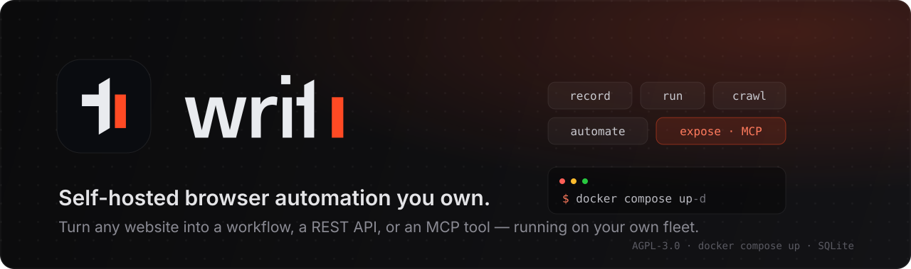
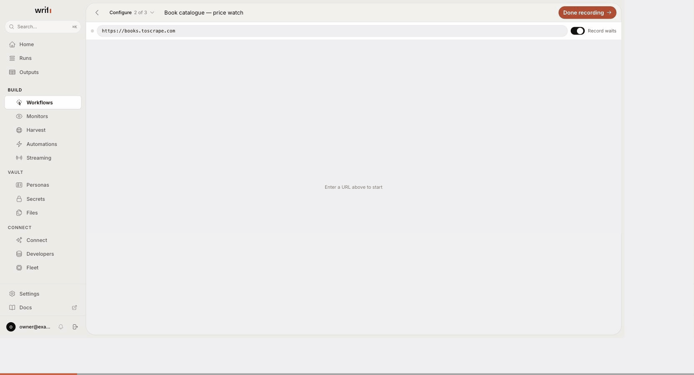
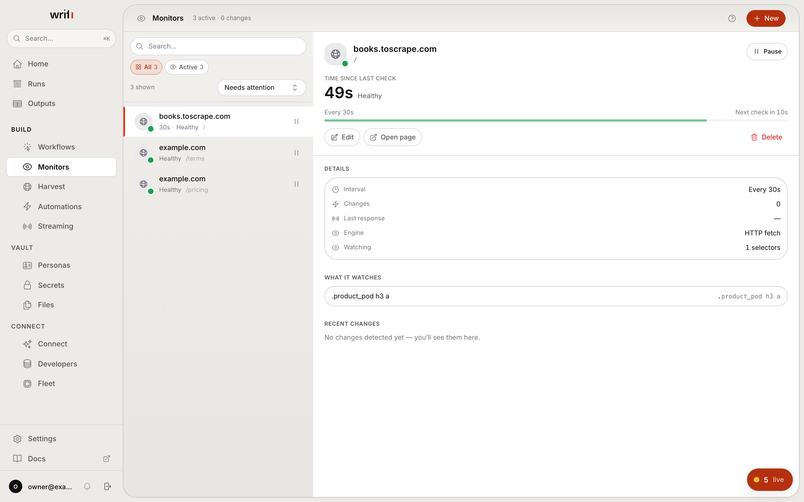
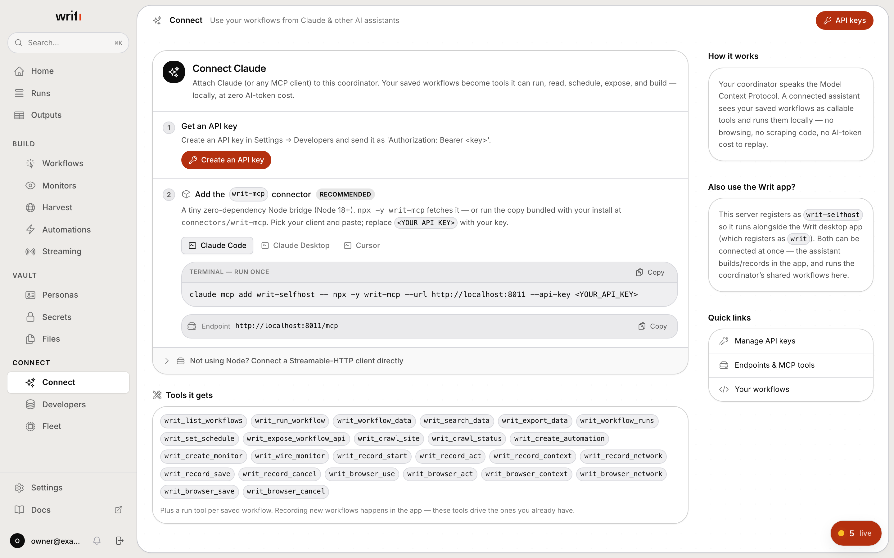
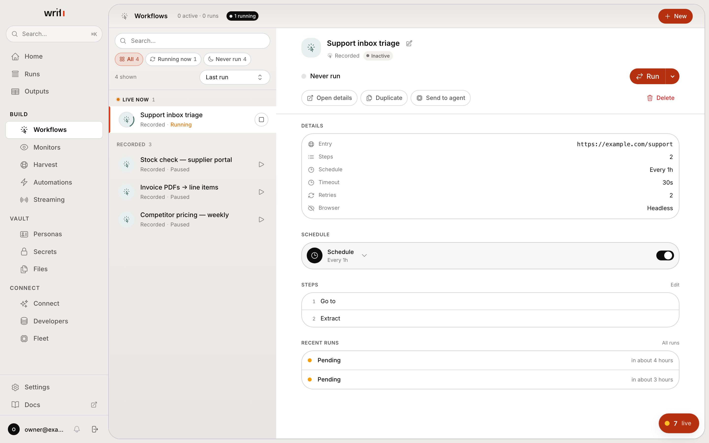
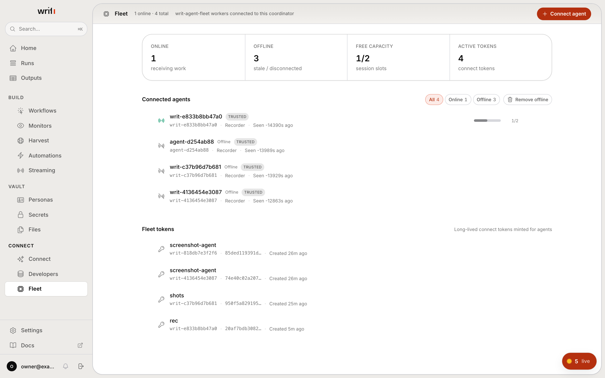
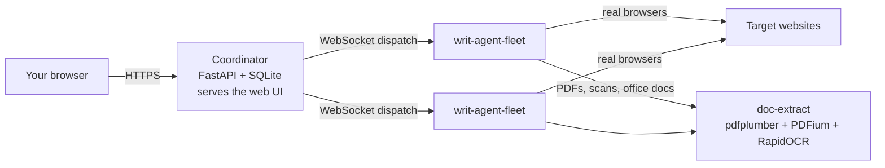

<div align="center">
  

  <br/>

  <p align="center">
    <a href="https://github.com/usewrit/writ/actions/workflows/ci.yml"></a>
    <a href="./LICENSE"></a>
    
    
    
    
    
  </p>

  <h3 align="center">Record a web task once. Replay it forever — free every run, on hardware you own.</h3>
  <p align="center">Turn any website into a workflow, a REST API, or an MCP tool.</p>

  <p align="center">
    <a href="#quickstart"><b>Quickstart</b></a> ·
    <a href="#what-you-can-do"><b>Features</b></a> ·
    <a href="#connect-your-ai-assistant-mcp"><b>Connect your AI</b></a> ·
    <a href="#agents-in-more-detail"><b>Agents</b></a> ·
    <a href="./docs/DEPLOYMENT.md"><b>Deploy</b></a> ·
    <a href="./SECURITY.md"><b>Security</b></a>
  </p>
</div>

---

**Writ** records a repeatable browser task once and replays it forever — no re-scraping,
no brittle scripts. This is the **open-source, self-hosted coordinator**: `docker compose
up` and it serves the web UI and API, stores everything in a single SQLite file, reads
PDFs and scanned pages, and dispatches all browser work to a fleet of lightweight
`writ-agent` processes you run wherever you like. Your box, your data, your agents.

> The Rust `writ-agent` lives in its **own repository**
> ([`writ-agent`](https://github.com/usewrit/writ-agent)) — install it separately and
> point it at this coordinator. This repo is the coordinator only (Python API + built
> web UI); it never launches a browser itself.

<div align="center">
  
  <br/>
  <sub><b>Record once.</b> Drive a real browser and every action lands as an editable step — then replay it forever at zero AI-token cost.</sub>
</div>

## Quickstart

You need Docker. Nothing else.

```bash
git clone https://github.com/usewrit/writ.git && cd writ
./scripts/gen-env.sh
docker compose up -d --build
```

Open **http://localhost:8000** and create your account. That is the whole install.

> First build takes a few minutes — the OCR runtime and its model weights are
> baked in so document extraction works offline.

### Then connect one agent

The coordinator runs no browsers itself, so **nothing will execute until one
agent is connected**. Open **Fleet → Connect a new agent**, copy the line it
shows you, and run it on whichever machine should do the browsing — your laptop
is fine:

```bash
curl -fsSL http://localhost:8000/agent.sh | sh -s -- WRIT-4K2P-9XQ
```

That installs the agent, enrols it, and starts it. The pairing code is single-use
and expires in 15 minutes; everything else — the coordinator URL, the
document-extractor address and its secret — the installer fetches for itself, so
there is nothing else to paste or configure.

The agent dials out over WebSocket, so it needs no inbound ports and can sit
behind NAT. It appears in **Fleet** within seconds, and you can record and run.

Prefer to do it by hand? The same modal has **Binary** and **Docker** tabs with
the raw token, and [docs/CONNECT_AGENT.md](docs/CONNECT_AGENT.md) is the full
reference. Sources for the binary: [`writ-agent`](https://github.com/usewrit/writ-agent)
[Releases](https://github.com/usewrit/writ-agent/releases), the
`ghcr.io/usewrit/writ-agent:latest` image, or build from source.

### Day-to-day

```bash
docker compose logs -f    # follow logs
docker compose restart    # restart
docker compose down       # stop, keep your data
docker compose down -v    # stop and delete everything
```

Run these from the repository root — the root `compose.yaml` wires in
`docker/docker-compose.yml` and loads your `.env` automatically.

<details>
<summary><b>Generate the secrets</b></summary>

<br/>

`./scripts/gen-env.sh` fills all of these in for you. To do it manually,
fill these into `.env`. Never commit the filled-in `.env`.

| Variable | How to generate |
| --- | --- |
| `WRIT_JWT_SECRET` | `openssl rand -hex 32` |
| `API_SECRET_KEY` | `openssl rand -hex 32` |
| `HMAC_SECRET_KEY` | `openssl rand -hex 32` |
| `RECORDER_AUTH_SECRET` | `openssl rand -hex 32` |
| `INTERNAL_API_SECRET` | `openssl rand -hex 32` |
| `GATEWAY_SECRET` | `openssl rand -hex 32` |
| `DOC_EXTRACT_SECRET` | `openssl rand -hex 32` |
| `SECRET_ENCRYPTION_KEY` | `python3 -c "from cryptography.fernet import Fernet; print(Fernet.generate_key().decode())"` |

> Every one of these is **required** — with the default `ENVIRONMENT=production`
> the coordinator refuses to boot if any is missing, blank, or shorter than 32
> characters. That is deliberate: HS256 signs happily with an empty key, so a
> half-filled template would otherwise leave the signing secret publicly known.

> **Back up `SECRET_ENCRYPTION_KEY` separately from your data volume.** It
> encrypts your stored secrets and credentials at rest. If you lose it, those
> values become unrecoverable — see [SECURITY.md](./SECURITY.md).

`WRIT_JWT_SECRET` is the operator-facing name; the compose file maps it onto the
`JWT_SECRET_KEY` the app reads. Set one, not both.

</details>

## Why self-host

- **You own everything.** One SQLite file, one volume. No managed cloud, no third-party
  data processor, no telemetry phoning home — nothing here makes an outbound call you
  did not ask for.
- **No browsers in the coordinator.** It never launches Chromium — your `writ-agent`
  fleet does the browsing, wherever you run it. That image is just Python + the UI.
- **PDFs and scans included.** The document/OCR extractor ships in the box and is wired
  up for you, so a crawl reads PDFs, Word/Excel/PowerPoint files and scanned pages
  instead of skipping them. CPU-only and fully offline — it works air-gapped.
- **No external database or cache services to run.** SQLite on disk plus an in-process queue. Back up one file.
- **MCP-native.** Point Claude Code, Claude Desktop, Cursor, or any MCP client at your
  coordinator and your saved workflows become tools it can run, read, schedule, and build.

## What you can do

**Capture the task once**

| | |
| --- | --- |
| 🎬 **Record** | Click through the task in a real browser — logins, forms, navigation, extractions — and save it as a replayable workflow. |
| 🧩 **Edit as steps** | Every recording is an editable step list, not an opaque blob. Fix a selector, add a wait, branch on a condition. |
| 🔐 **Personas** | Store a site's login once as a persona: credentials and TOTP seeds Fernet-encrypted at rest, and a warm cookie/localStorage session reused across every workflow that needs it. Handles 2FA (TOTP, email OTP, SMS). |

**Then run it, on your terms**

| | |
| --- | --- |
| ▶️ **Run** | Replay on your fleet and get structured data back — locally, at zero AI-token cost. Recording uses AI once; replay never does. |
| 🗓️ **Schedule** | An interval, or a daily/weekly wall-clock time. |
| 👀 **Monitor** | Watch a page or a CSS selector for changes. Keeps uptime, SSL-expiry and change history, and can fire a workflow the moment something moves. |
| 🔀 **Automate** | Chain events to actions: when a workflow finishes or a monitor trips, run another, POST a webhook, or send a notification. |
| 🕸️ **Crawl** | Point a distributed crawl at a whole site, sharded across your agent fleet. |
| 📄 **Read documents** | PDFs, Word/Excel/PowerPoint, images and scanned pages — parsed and OCR'd on your own CPU, fully offline. |

**And hand it to whatever consumes it**

| | |
| --- | --- |
| 🔌 **REST endpoint** | Publish any workflow as an HTTP endpoint with its own API key and scopes. |
| 🤖 **MCP tool** | Your saved workflows become 25 tools an AI assistant can run, read, schedule, expose — and *build*, by driving a live recording session. |
| 💬 **OpenAI-compatible** | Serve a workflow as `/v1/chat/completions`, `/v1/models` and `/v1/responses`, so any OpenAI SDK can point at it with a base-URL change. |
| 🗃️ **Datasets** | Every run appends to a searchable dataset. Query across all history, or export it. |

## What it looks like

<table>
<tr>
<td width="50%"><br/><sub><b>Monitors</b> — watch a page or a selector. Uptime, SSL expiry and change history, with the next check counting down.</sub></td>
<td width="50%"><br/><sub><b>Connect your AI</b> — paste one command and your workflows become tools. The page generates the snippet for your client, prefilled.</sub></td>
</tr>
<tr>
<td width="50%"><br/><sub><b>Workflows</b> — every recording is an editable step list, with its schedule and run history beside it.</sub></td>
<td width="50%"><br/><sub><b>Fleet</b> — connect as many agents as you like, wherever you run them. The connect command is generated for you.</sub></td>
</tr>
</table>

## Why this and not a scraping API or an AI agent

Three approaches exist for "get me this data off the web". They differ in where
the intelligence sits, and that decides everything else.

| | Hosted scraping API | AI browser agent | **Writ** |
| --- | --- | --- | --- |
| **When AI is used** | Never — you write selectors | **Every run**, re-reasoning the page each time | **Once**, at record time |
| **Cost per run** | Per page/credit, forever | LLM tokens per run — scales with how often you run it | **Zero.** Replay is deterministic execution |
| **Same result twice?** | Yes, until the markup shifts | Not guaranteed — a fresh decision each time | Yes — it replays the steps you recorded |
| **Where your data lands** | Their cloud | Their cloud, plus a model provider | **Your disk.** One SQLite file |
| **Logged-in sites** | Usually out of scope | Fragile — credentials go to a third party | First-class: encrypted logins, TOTP/OTP, warm sessions |
| **Which IPs browse** | Theirs | Theirs | Yours — agents run wherever you put them |
| **Runs air-gapped** | No | No | Yes, including OCR |

The cost line is the one that compounds. An agent that reasons its way through a
checkout flow costs tokens on run 1 and the same again on run 10,000. Writ
spends the AI once — while you record — and every replay after that is your own
machine executing a saved step list. A daily monitor costs nothing to keep
running.

The determinism line is the one that wakes you at 3am. Re-deciding the page each
run means a run can silently do something *different* from yesterday's. A
recorded workflow does what it did last time, and when a site really does change,
it fails loudly and points at the step that broke instead of improvising.

And it is AGPL-3.0 with **no feature gates**: everything above is in this
repository. Nothing here is a locked trial tier — read it, fork it, run it.

## How it fits together



`docker compose up` starts two containers: the **coordinator**, which holds the
data and serves the UI, and **doc-extract**, which reads any non-HTML file the
crawl reaches. Then any number of `writ-agent-fleet` workers, wherever you run
them, do the browsing.

Note the arrows: agents call doc-extract directly with bytes they already
fetched — the coordinator never touches it. The coordinator does hand each agent
that address when it connects, so you never configure it yourself.

## Connect your AI assistant (MCP)

Your coordinator speaks the **Model Context Protocol**. Attach an AI client and your saved
workflows become tools it can run, read, schedule, expose — and even *build* by recording.

**1. Create an API key** in the app → **Developers → API keys**.
**2. Add the connector to your client.** The bundled [`writ-mcp`](./connectors/writ-mcp)
bridge is a zero-dependency stdio↔HTTP proxy (it also ships in the repo, so no install is
strictly required). The app's **Connect** page generates these snippets for you, prefilled
with your endpoint.

<details open>
<summary><b>Claude Code</b></summary>

```bash
claude mcp add writ-selfhost -e WRIT_API_KEY=<YOUR_API_KEY> -- npx -y writ-mcp --url http://localhost:8000
```
</details>

<details>
<summary><b>Claude Desktop / Cursor (config file)</b></summary>

```json
{
  "mcpServers": {
    "writ-selfhost": {
      "command": "npx",
      "args": ["-y", "writ-mcp", "--url", "http://localhost:8000"],
      "env": { "WRIT_API_KEY": "<YOUR_API_KEY>" }
    }
  }
}
```
</details>

<details>
<summary><b>Any Streamable-HTTP client (no Node)</b></summary>

```json
{
  "mcpServers": {
    "writ-selfhost": {
      "type": "http",
      "url": "http://localhost:8000/mcp",
      "headers": { "Authorization": "Bearer <YOUR_API_KEY>" }
    }
  }
}
```
</details>

> It registers as `writ-selfhost` on purpose, so it coexists with the Writ desktop app
> (which registers as `writ`). The server identifies itself to the AI as *"Writ Self-Host
> Coordinator"* — never confused with the desktop app.

**The tools your assistant gets** — 25 of them, plus a `run_<name>` tool per saved workflow:

| Family | Tools |
| --- | --- |
| **Operate** | `writ_list_workflows` · `writ_run_workflow` · `writ_workflow_data` · `writ_search_data` · `writ_export_data` · `writ_workflow_runs` |
| **Automate** | `writ_set_schedule` · `writ_expose_workflow_api` · `writ_create_automation` · `writ_create_monitor` · `writ_wire_monitor` |
| **Crawl** | `writ_crawl_site` · `writ_crawl_status` |
| **Build** (un-guided) | `writ_record_start` · `writ_record_act` · `writ_record_context` · `writ_record_network` · `writ_record_save` · `writ_record_cancel` |
| **Drive a browser** | `writ_browser_use` · `writ_browser_act` · `writ_browser_context` · `writ_browser_network` · `writ_browser_save` · `writ_browser_cancel` |

Building is **un-guided**: the AI drives a live record session on your fleet, and asks
you for clarifications directly in the chat.

> **Give the key the `mcp:execute` scope.** API keys are scoped, and the MCP
> endpoint checks for that one specifically — without it every call returns
> `API key is missing the 'mcp:execute' scope`. Add the resource scopes you want
> the assistant to have alongside it (`workflows:read`, `workflows:execute`,
> `runs:read`, `datasets:read` is a sensible starting set).

## Agents, in more detail

The quickstart above covers the common case. A few things worth knowing once you
have more than one agent:

- **Run as many as you like.** Each dials out over WebSocket — no inbound ports,
  NAT is fine — and the coordinator spreads work across whichever have capacity.
- **Sitting at the coordinator's own machine?** **Fleet → run an agent on this
  host** does the download, configure and launch for you.
- **Agents on other machines** cannot reach the document extractor's default
  loopback address. Set `DOC_EXTRACT_URL` in `.env` to something routable and
  every generated connect command picks it up — see
  [docs/DEPLOYMENT.md](docs/DEPLOYMENT.md).
- **Building from source:**
  `cargo build --release --no-default-features --features local,fleet,openai --bin writ-agent-fleet`

[docs/CONNECT_AGENT.md](docs/CONNECT_AGENT.md) is the full reference — install
paths, every environment variable, healthchecks and troubleshooting.

<details>
<summary><b>Production notes</b></summary>

<br/>

The defaults are tuned for a quick local trial — the compose file publishes the
port on loopback only (`127.0.0.1:8000`). Before exposing this to the internet
(full guide: [docs/DEPLOYMENT.md](docs/DEPLOYMENT.md)):

1. **Put a TLS reverse proxy in front** (nginx, Caddy, Traefik, …). Terminate HTTPS there
   and forward to `127.0.0.1:8000`. Do **not** publish port `8000` on a public interface.
2. **Set `WRIT_PUBLIC_URL` to your public https URL** (e.g. `https://writ.example.com`).
   Agents use it to dial back in, so it must be reachable from wherever your agents run.
3. **Switch `ENVIRONMENT=production`.** Enforces strong secrets, a Host allowlist, and
   refuses a wildcard CORS policy.
4. **Set `ALLOWED_HOSTS`** to the hostname(s) this coordinator answers on (comma-separated,
   no scheme/port). Spoofed `Host` headers are rejected in production.
5. **Set `CORS_ORIGINS`** to your explicit https origin(s) — `*` is refused in production.
6. **Trust only your proxy for forwarded IPs**, so per-IP rate limiting sees the real client IP.

Because your proxy terminates TLS, the container keeps listening on plain HTTP `:8000` on
the internal network — that is expected.

</details>

<details>
<summary><b>Forgot the admin password?</b></summary>

<br/>

There's no email reset (self-host has no required mail server). Because the coordinator is
single-owner, whoever has server access resets the password directly:

```bash
# Docker
docker compose -f docker/docker-compose.yml exec coordinator python reset_password.py
docker compose -f docker/docker-compose.yml exec coordinator python reset_password.py --password 'YourNewPass1'

# Local (run-local.sh) install
bash reset-admin-password.sh
bash reset-admin-password.sh --password 'YourNewPass1'
bash reset-admin-password.sh --list
```

The reset also re-activates a disabled account. To start over completely, stop the app and
delete the database file (`/data/writ.db` in Docker, `./.local/data/writ.db` locally) — the
next visit shows first-run setup again.

</details>

## What's in the box

| Path | What it is |
| --- | --- |
| `coordinator/` | The Python API + Alembic migrations (the runtime). |
| `ui/` | The built web UI (SPA) served by the coordinator. |
| `doc-extract/` | The document + OCR extraction service (PDF, office files, scans). |
| `connectors/writ-mcp/` | Zero-dependency Node MCP connector (stdio↔HTTP bridge). |
| `docker/` | `Dockerfile.coordinator`, `Dockerfile.doc-extract`, `docker-compose.yml`, `entrypoint.sh`. |
| `docs/` | Operator guides (agent connect walkthrough, production deployment). |
| `scripts/gen-env.sh` | Generates a filled-in `.env` with fresh secrets. |

Health endpoints are `GET /health` on the coordinator (`:8000`) and on
doc-extract (`:8092`) — both JSON, and both used by the container `HEALTHCHECK`
and the compose healthcheck.

To run without document extraction, start `docker compose up -d coordinator`
alone and set `DOC_EXTRACT_URL=` (empty) in `.env`. Crawls then skip every
non-HTML resource they reach — a silent no-op, never an error.

## Community & support

- **Operator documentation** lives in this repository, so it can never drift
  from the version you are running: [`docs/DEPLOYMENT.md`](./docs/DEPLOYMENT.md)
  for putting it behind TLS in production, [`docs/CONNECT_AGENT.md`](./docs/CONNECT_AGENT.md)
  for the full agent walkthrough (install paths, env reference, healthchecks,
  troubleshooting), and [`doc-extract/README.md`](./doc-extract/README.md) for
  the extraction service. This README covers everything else.
- **Bugs & feature requests** — open a [GitHub Issue](../../issues); templates
  are provided.
- **Questions, setup help, show & tell** — use
  [GitHub Discussions](../../discussions).
- **Security issues** — please report privately; see [SECURITY.md](./SECURITY.md).

## Contributing

Issues and pull requests are welcome. Please read
[CONTRIBUTING.md](./CONTRIBUTING.md) and the
[Code of Conduct](./CODE_OF_CONDUCT.md) first, and report security issues privately per
[SECURITY.md](./SECURITY.md).

## License

Copyright © 2026 The Writ Project Authors.

Licensed under the **GNU Affero General Public License, version 3** (`AGPL-3.0-only`) —
see [`LICENSE`](./LICENSE).

| Path | License |
| --- | --- |
| everything except the rows below | **AGPL-3.0-only** ([`LICENSE`](./LICENSE)) |
| `connectors/writ-mcp/` | **MIT** ([`LICENSE`](./connectors/writ-mcp/LICENSE)) — it runs inside *your* MCP client, so it has to be embeddable anywhere |
| bundled fonts | **SIL OFL 1.1** ([`THIRD_PARTY_NOTICES.md`](./THIRD_PARTY_NOTICES.md)) |
| the Rust `writ-agent` | its own repository, its own license — not distributed here |

**AGPL-3.0 §13 — the network source offer.** This is a *network* copyleft license: if
you modify the coordinator and let anyone else interact with it over a network, you owe
them the complete corresponding source of **your** modified version. The app makes that
offer for you — it serves a public `GET /api/about` and links it from the login screen
and **Settings → General**. If you deploy a patched build, set

```bash
WRIT_SOURCE_URL=https://github.com/you/your-fork
```

so that link points at your source instead of upstream. It is the one thing a fork must
change to stay compliant.

Bundled third-party material — the Inter and Schibsted Grotesk typefaces, both under the
SIL Open Font License 1.1 — is attributed in
[`THIRD_PARTY_NOTICES.md`](./THIRD_PARTY_NOTICES.md). The Writ name, wordmark, glyph, and
tile are trademarks and are **not** covered by the AGPL grant; read that file before
rebranding a fork.
